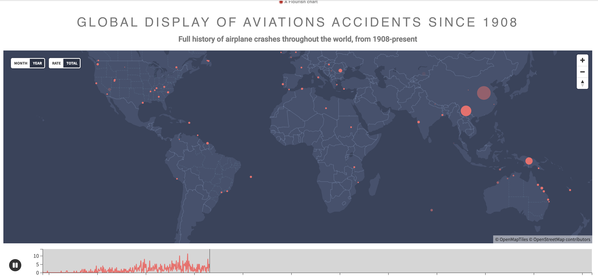

# Airplane Crash History

This repo aims to tell an infographic design-thinking story about the history of airplane crashes. The goal is to dismiss the flase phobia around flying, & encourage people to board flights more often, after seeing a story told that is reassuring.

## Acknowledgements

 - [SwipeiX](https://www.linkedin.com/company/swipe-ix/mycompany/)
 - [Deon Heunis](https://www.linkedin.com/in/deon-heunis-b700488/)
 - [Leo Redelinghuys](https://www.linkedin.com/in/leoredelinghuys/)
 - [New Media](https://www.linkedin.com/company/new-media/)

## Authors
 - [Tevin Morake](https://github.com/tevin-morake)
 - [Deon Heunis](https://github.com/deonheunis)
 - [Muneer Manie](https://www.linkedin.com/in/muneer-manie-21081312b/)
 - [Andre van Heerden](https://github.com/skellstaff)

## Demo

## Feedback

If you have any feedback, please reach out to us at tevin@swipeix.com

## 🚀 About Me
I'm just a guy who types all day. The things I type normally end up being explosive and colourful stories

